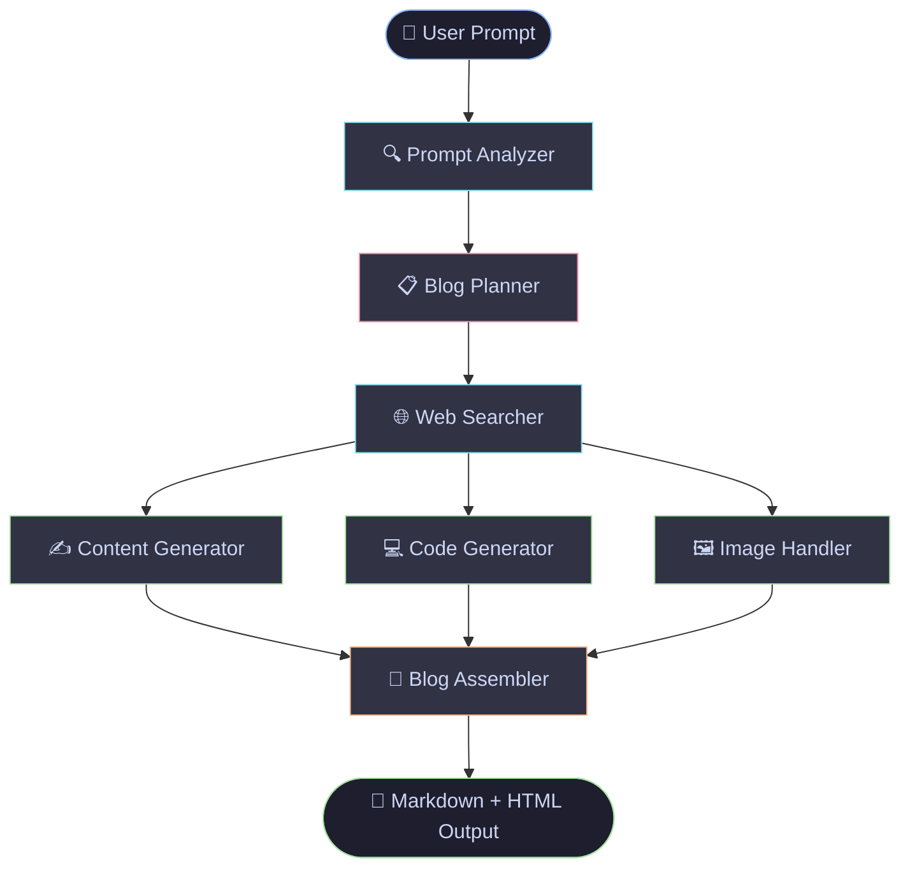
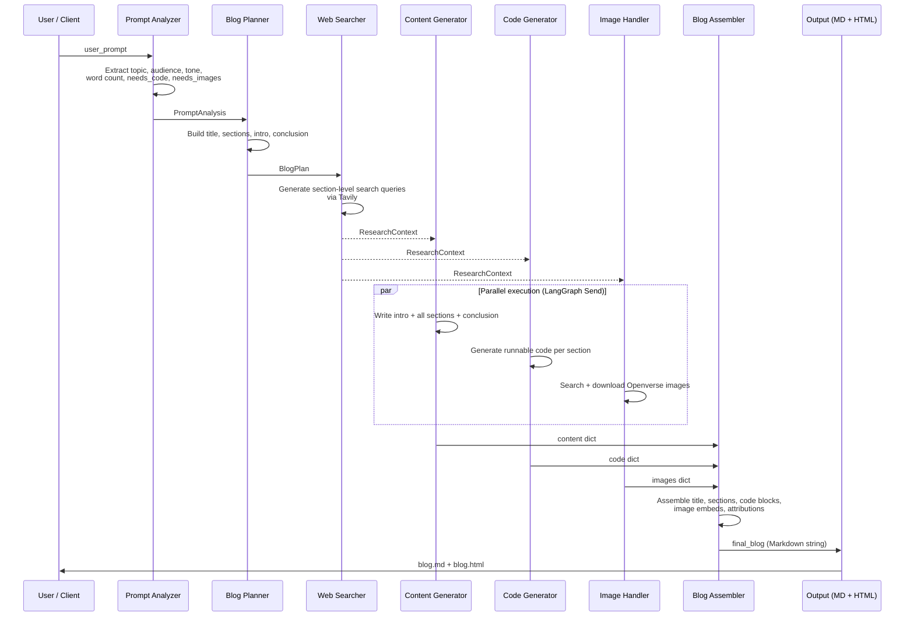
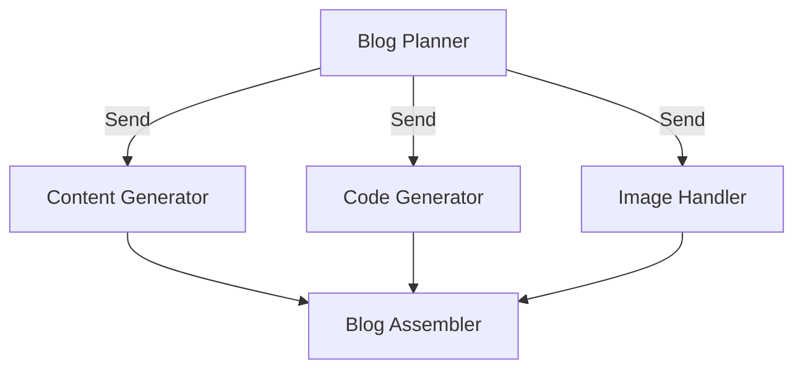
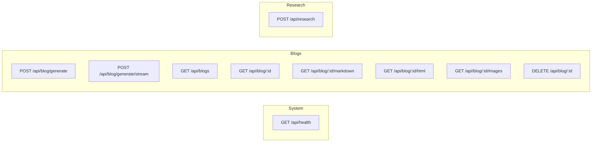

# WriterAgent 🖊️

> **An AI-powered, research-backed blog generation pipeline built with LangGraph, Google Gemini, and FastAPI.**
>
> Give it a topic. Get back a fully structured, web-researched, illustrated technical blog post — complete with code examples, royalty-free images, and clean Markdown/HTML output.

---

## Table of Contents

- [Overview](#overview)
- [Architecture](#architecture)
  - [Pipeline Graph](#pipeline-graph)
  - [Execution Flow](#execution-flow)
- [Pipeline Nodes](#pipeline-nodes)
- [Tech Stack](#tech-stack)
- [Quickstart](#quickstart)
  - [CLI Mode](#cli-mode)
  - [API + Web UI Mode](#api--web-ui-mode)
- [API Reference](#api-reference)
- [Configuration](#configuration)
- [Output](#output)
- [License](#license)

---

## Overview

WriterAgent is a **multi-agent LangGraph pipeline** that turns a plain-text prompt into a production-ready blog post. It is designed around a clean separation of concerns: each node in the graph has exactly one job, three of them run **in parallel** after planning, and a final assembler stitches the results into a single Markdown + HTML artifact.

The system ships in two modes:

| Mode | Entry Point | Use Case |
|---|---|---|
| **CLI** | `main.py` | Quick local generation, scripted pipelines |
| **API + Web UI** | `uvicorn api.main:app` | REST integration, streaming, persistent blog store |

---

## Architecture

### Pipeline Graph



The three parallel branches — **Content**, **Code**, and **Images** — are dispatched by LangGraph's `Send` primitive after planning completes, then joined at the assembler.

---

### Execution Flow



---

## Pipeline Nodes

| Node | File | Input Keys | Output Key | Description |
|---|---|---|---|---|
| **Prompt Analyzer** | `app/nodes/analyzer.py` | `user_prompt` | `analysis` | Extracts topic, audience, tone, word count, and whether code / images are needed |
| **Blog Planner** | `app/nodes/planner.py` | `analysis` | `plan` | Produces a structured blueprint — title, intro, sections with flags, conclusion |
| **Web Searcher** | `app/nodes/researcher.py` | `analysis`, `plan` | `research` | Runs one Tavily search per section; returns scored sources as `ResearchContext` |
| **Content Generator** | `app/nodes/content.py` | `analysis`, `plan`, `research` | `content` | Writes intro, all sections, and conclusion in full using the top-scored sources |
| **Code Generator** | `app/nodes/code.py` | `analysis`, `plan` | `code` | Produces runnable code examples with dependencies for sections flagged `needs_code` |
| **Image Handler** | `app/nodes/images.py` | `analysis`, `plan` | `images` | Searches Openverse for CC-licensed images and downloads them for flagged sections |
| **Blog Assembler** | `app/nodes/assembler.py` | `plan`, `content`, `code`, `images` | `final_blog` | Joins all parts into a single Markdown string with attribution and code blocks |

### Node detail: parallel dispatch



The three generators run concurrently through LangGraph's `dispatch_parallel` conditional edge, which fans out via `Send` and fans back in at the assembler once all three complete.

---

## Tech Stack

| Layer | Technology | Role |
|---|---|---|
| **Agent orchestration** | [LangGraph](https://github.com/langchain-ai/langgraph) | Stateful multi-node pipeline with parallel dispatch |
| **LLM** | Google Gemini (`gemini-3.6-flash`) via `langchain-google-genai` | Structured output generation at every node |
| **Structured output** | Pydantic + `with_structured_output` | Type-safe LLM responses across all nodes |
| **Web research** | [Tavily](https://tavily.com) | Real-time web search grounding |
| **Image search** | [Openverse](https://openverse.org) | CC-licensed royalty-free images |
| **API framework** | [FastAPI](https://fastapi.tiangolo.com) | REST endpoints, SSE streaming, OpenAPI docs |
| **Streaming** | Server-Sent Events (SSE) | Node-by-node progress updates to clients |
| **In-memory store** | `JobStore` (threading.Lock) | Thread-safe blog persistence within a session |
| **HTML rendering** | Python `markdown` library | Converts final Markdown to publishable HTML |
| **Configuration** | `pydantic-settings` | Environment variable loading from `.env` |

---

## Quickstart

### Prerequisites

- Python 3.11+
- A [Google AI Studio API key](https://aistudio.google.com/app/apikey)
- A [Tavily API key](https://tavily.com)

### 1. Clone and install

```bash
git clone https://github.com/ma74a/WriterAgent.git
cd WriterAgent
pip install -r requirements.txt
```

### 2. Set environment variables

Create a `.env` file in the project root:

```env
GOOGLE_API_KEY=your_google_api_key
TAVILY_API_KEY=your_tavily_api_key

# Optional: restrict CORS origins for the API server
ALLOWED_ORIGINS=http://localhost:3000,https://yourdomain.com
```

| Variable | Required | Description |
|---|---|---|
| `GOOGLE_API_KEY` | ✅ | Gemini model access |
| `TAVILY_API_KEY` | ✅ | Web research via Tavily |
| `ALLOWED_ORIGINS` | ❌ | Comma-separated CORS origins (default: `*`) |

---

### CLI Mode

Edit the `user_prompt` in `main.py`:

```python
user_prompt = """
Write a technical but beginner-friendly blog post explaining
how to build a YOLO project using Python.

Include practical code examples, explain the architecture,
and include diagrams where useful.

The article should be approximately 2000 words.
"""
```

Then run:

```bash
python main.py
```

Output is written to `output/`:

```
output/
├── blog.md          # Structured Markdown
├── blog.html        # Rendered HTML, ready to publish
└── images/          # Downloaded section images with attribution metadata
```

---

### API + Web UI Mode

Start the FastAPI server:

```bash
uvicorn api.main:app --reload
```

Then open:

| Interface | URL |
|---|---|
| Web UI | `http://localhost:8000/` |
| Interactive API docs (Swagger) | `http://localhost:8000/docs` |
| ReDoc | `http://localhost:8000/redoc` |

---

## API Reference

### Endpoints overview



### Endpoint details

#### `POST /api/blog/generate`
Synchronously run the full pipeline and return the complete blog.

**Request:**
```json
{ "prompt": "Write a beginner-friendly post about transformers in NLP." }
```

**Response:** `BlogResponse` — includes `id`, `blog` (Markdown), `analysis`, `plan`, `research`, `code`, `images`, `created_at`.

---

#### `POST /api/blog/generate/stream`
Stream Server-Sent Events (SSE) — one event per completed LangGraph node.

**Request:** same as `/generate`

**SSE Event shape:**
```json
{
  "event": "node_complete",
  "job_id": "uuid",
  "node": "prompt_analyzer",
  "data": { ... }
}
```
Final event has `"event": "done"` and carries the complete blog payload.

---

#### `GET /api/blogs`
List all in-memory blog posts, newest first.

#### `GET /api/blog/{id}`
Retrieve a single blog by UUID.

#### `GET /api/blog/{id}/markdown`
Returns raw Markdown as `text/plain`.

#### `GET /api/blog/{id}/html`
Returns rendered HTML as `text/html` (no disk write).

#### `GET /api/blog/{id}/images`
Returns image attribution metadata list (no internal paths exposed).

#### `DELETE /api/blog/{id}`
Delete a blog from the in-memory store.

#### `POST /api/research`
Direct Tavily web search, without exposing credentials.

**Request:**
```json
{ "query": "latest YOLO architecture improvements 2025" }
```

---

## Configuration

All settings are loaded via `pydantic-settings` from environment variables or `.env`:

```python
class Settings(BaseSettings):
    GOOGLE_API_KEY: str = ""
    TAVILY_API_KEY: str = ""
    ALLOWED_ORIGINS: str = "*"   # comma-separated list or "*"
```

The LLM is configured in `app/llm.py`:

```python
llm = ChatGoogleGenerativeAI(
    model="gemini-3.6-flash",
    max_retries=5,      # Exponential backoff on 429s
    timeout=60,
    temperature=0.2,    # Low temperature for factual, consistent output
)
```

---

## Output

Given a prompt like:

> *Write a technical but beginner-friendly blog post explaining how to build a YOLO project using Python. Include practical code examples, explain the architecture, and include diagrams where useful. Approximately 2000 words.*

WriterAgent produces:

```
output/
├── blog.md                     # Structured Markdown with headings, code blocks, image embeds
├── blog.html                   # Rendered HTML — ready to publish or paste into a CMS
└── images/
    ├── yolo-architecture.jpg   # Downloaded from Openverse, CC-licensed
    ├── training-loop.jpg
    └── ...
```

---

## License

MIT